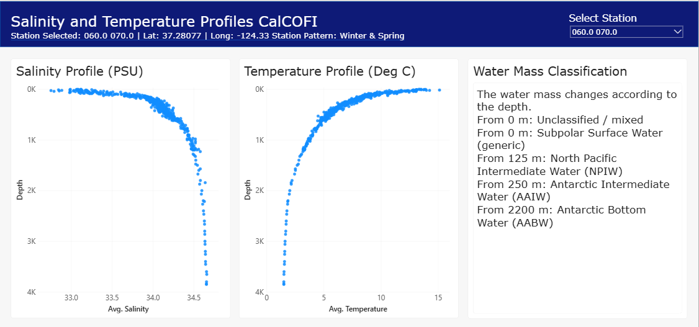
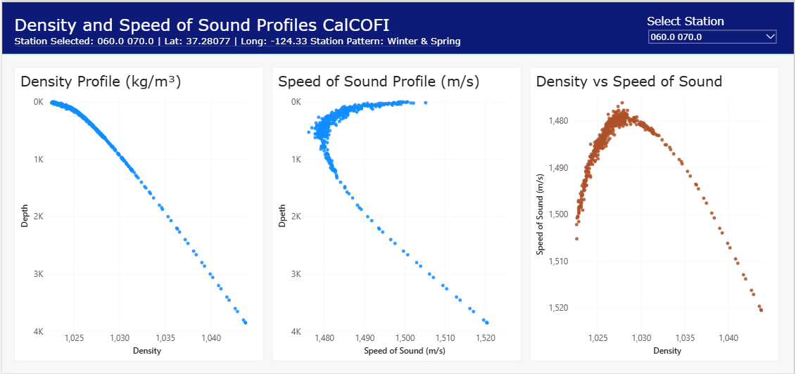

# oceanlib (Power Query + DAX edition)

[](LICENSE) [](#) [](#)

A small physical-oceanography toolkit built entirely in M (Power
Query) and DAX -- no Python required anywhere in this version.

## What's here

[#whats-here](#whats-here)

**`power-query/`** -- one `.m` file per custom function. Each is
meant to be pasted into a Blank Query's Advanced Editor in Power BI
Desktop, then invoked as a custom column or standalone step.

| File                                                    | Does                                                              |
| ------------------------------------------------------- | ----------------------------------------------------------------- |
| `fn_SoundSpeedMackenzie.m`                              | Speed of sound in seawater (Mackenzie 1981 formula)               |
| `fn_ApproxDensity.m`                                    | Simplified seawater density estimate                              |
| `fn_PracticalSalinity.m`                                | Practical salinity from conductivity ratio (PSS-78, UNESCO 1981)  |
| `fn_ClassifyWaterMass.m`                                | Water mass ID from a T-S pair (range lookup vs. published envelopes) |
| `fn_SubInertialFilter.m`                                | Moving-average low-pass filter (approximates sub-inertial signal) |
| `fn_QCFlag.m`                                           | Range-based QC flag (1 = pass, 4 = fail)                          |
| `fn_KnotsToMs.m`, `fn_MsToKnots.m`, `fn_DbarToMetres.m` | Unit conversions                                                  |
| `fn_HaversineDistance.m`                                | Great-circle distance between two lat/lon points                  |
| `fn_InitialBearing.m`                                   | Initial bearing (forward azimuth) between two lat/lon points      |
| `fn_DestinationPoint.m`                                 | Destination lat/lon given a start point, bearing, and distance    |

**`dax/oceanlib_udfs.dax`** -- DAX user-defined functions (Power BI
Desktop/Service, June 2026 GA onward). All functions live in this one
file; these are model-level functions you can call from any measure.

| Function                           | Does                                                                |
| ----------------------------------- | -------------------------------------------------------------------- |
| `TidalForecast`                     | Reconstructs tide height from a loaded harmonic constituents table   |
| `ApproxDensity`                     | Simplified seawater density estimate                                 |
| `SoundSpeedMackenzie`               | Speed of sound in seawater (Mackenzie 1981 formula)                  |
| `PracticalSalinity`                 | Practical salinity from conductivity ratio (PSS-78, UNESCO 1981)     |
| `ClassifyWaterMass`                 | Water mass ID from a T-S pair (range lookup vs. published envelopes) |
| `HaversineDistance`                 | Great-circle distance between two lat/lon points                     |
| `InitialBearing`                    | Initial bearing (forward azimuth) between two lat/lon points         |
| `DestinationLat`, `DestinationLon`  | Destination lat/lon given a start point, bearing, and distance       |
| `Atan2`                             | Internal helper (DAX has no native ATAN2) -- not meant to be called directly, used internally by the bearing/distance/destination functions |

**`template/`** -- a ready-to-use Power BI template (`.pbit`) built
from these functions, demonstrating `SoundSpeedMackenzie` and
`ClassifyWaterMass` against real CalCOFI depth-profile data. See
[Try it: Power BI template](#try-it-power-bi-template) below.

**`sample-data/`** -- data to run the template against. See
[Sample data](#sample-data) below.

## Try it: Power BI template

[#try-it-power-bi-template](#try-it-power-bi-template)

`template/` contains a ready-to-use Power BI template
(`.pbit`) with the report design, data model, measures, and both
custom functions (`fn_SoundSpeedMackenzie`, `fn_ClassifyWaterMass`)
already built in. It has no data of its own -- point it at your own
files and it builds the full report from scratch.

### Screenshots

**Salinity and Temperature depth profiles, with a station selector:**



**Density and Speed of Sound profiles, including the Density vs.
Speed of Sound correlation panel:**



### How to use the template

1. Get your data ready -- see [Sample data](#sample-data) below for
   where to find a small station lookup file and the full
   temperature/salinity dataset.
2. Double-click the `.pbit` file in `template/`.
3. Power BI will prompt for two parameters:
   - **FactTableFilePath** -- full path to your temperature/salinity
     file, including the filename
     (e.g. `C:\Data\CalCOFI_Tempt and Salinity.csv`)
   - **DimTableFilePath** -- full path to your station lookup file,
     including the filename
     (e.g. `C:\Data\CalCOFIStationOrder.csv`)
4. Click **Load**. The report should populate with your data.

Column names must match what the queries expect:

| File | Expected columns |
| --- | --- |
| Temperature/salinity (fact) | `Btl_Cnt`, `Sta_ID`, `Depthm`, `T_degC`, `Salnty` |
| Station lookup (dimension) | `Line`, `Sta`, `Lat (dec)`, `Lon (dec)` |

If a column name doesn't match, the query will error at the first
step that references it -- open Power Query Editor (Transform Data)
to see exactly which step failed.

### What's in the report

- Depth profiles for Salinity, Temperature, Speed of Sound, and
  Density, all sharing a consistent depth-inverted Y-axis so they're
  directly comparable
- A Density vs. Speed of Sound correlation panel with a trend line
- A station selector slicer and a dynamic subtitle showing the
  selected station's coordinates
- A Water Mass Classification card, summarising which water masses a
  station's profile passes through and at what depth each one begins
- A Survey Season indicator (Summer & Fall vs. Winter & Spring)
  based on which CalCOFI station line the point sits on

### If refresh fails

- **Column not found** -- almost always a column-name mismatch; see
  the table above.
- **File not found** -- check both parameters for typos via
  **Transform Data > Manage Parameters**.

## Sample data

[#sample-data](#sample-data)

`sample-data/` contains:

- **`CalCOFIStationOrder.csv`** -- the station lookup file, small
  enough to include directly in this repo. Point `DimTableFilePath`
  at this file as-is.
- **`download-link.txt`** -- instructions and a link for the
  temperature/salinity bottle data, which is too large to host in
  this repo (even a filtered extract exceeds GitHub's practical file
  size limits). It points to the official CalCOFI Hydrographic
  (Bottle) Database download, with full citation details.

After downloading and unzipping the bottle database, either filter
it down to one or two stations before pointing the template at it
(recommended -- the template is built around single-station depth
profiles), or point the template directly at the full file to
explore multiple stations via the Select Station slicer.

## Tides: what has to happen before you can forecast

[#tides-what-has-to-happen-before-you-can-forecast](#tides-what-has-to-happen-before-you-can-forecast)

`TidalForecast` reconstructs a tide from known harmonic constituents
(a frequency, amplitude, and phase for each of M2, S2, K1, O1, etc.)
-- it does **not** derive those constituents from raw data. Fitting
them is a least-squares solve, which doesn't translate well into M or
DAX (no linear algebra engine), so that step is deliberately left out
of this scaffold.

Before `TidalForecast` is usable, you need a small `Constituents`
table (columns: `Frequency_cph`, `Amplitude`, `Phase_deg`) loaded
into the model. Two ways to get it, neither requiring Python:

1. **Published constituents for a real station** -- NOAA CO-OPS (US
stations, freely available) or UKHO/Admiralty tide tables (UK
stations) publish amplitude/phase per constituent. Pull these once
and load as a static table.
2. **A one-off external fit** -- if you still have old MATLAB
`T_TIDE`/UTide output from university, or get someone to run the
fit once outside Power BI, load just the resulting table.

Either way, everything downstream (the DAX UDF, any measure that uses
it) only ever touches that small table -- never the raw time series.

## Sub-inertial filtering caveat

[#sub-inertial-filtering-caveat](#sub-inertial-filtering-caveat)

`fn_SubInertialFilter.m` uses a centred moving average rather than a
proper digital (e.g. Butterworth) filter, since M has no signal-
processing library. Set the window to roughly one inertial period at
your latitude. It's a reasonable approximation, not a research-grade
filter -- there will be some edge effects and less clean frequency
separation than a proper filter design would give.

## Density caveat

[#density-caveat](#density-caveat)

`fn_ApproxDensity.m` / `ApproxDensity` (DAX) use a simplified,
linearised formula -- not the full TEOS-10 equation of state, which is
a large polynomial fit that isn't practical to hand-code in M or DAX.
It linearises around a reference point (T0 = 10°C, S0 = 35 PSU,
Rho0 = 1025 kg/m3) using representative thermal expansion / haline
contraction coefficients, plus a small linear correction for the
pressure increase with depth. It's an own linearisation, not a
derivation of a published standard.

This is fine for a rough estimate or a quick in-model lookup, but
don't rely on it where accuracy matters (e.g. anything feeding a
scientific calculation downstream). Valid roughly for T: 0-30°C,
S: 30-40 PSU -- accuracy degrades near freezing and in fresh/brackish
water, and it does not capture cabbeling or thermobaric effects
(mixing two water masses of different T/S can produce water denser
than either parent -- a linear equation of state can't represent
this). If you need TEOS-10-accurate density, the practical route is
to compute it once elsewhere (e.g. the TEOS-10 GSW toolbox, or an
online calculator) and load the results as a table, the same pattern
as the tidal constituents above.

## Sound speed caveat

[#sound-speed-caveat](#sound-speed-caveat)

`fn_SoundSpeedMackenzie.m` / `SoundSpeedMackenzie` (DAX) use the
Mackenzie (1981) empirical equation, valid roughly for temperature
-2 to 30°C, salinity 30-40 PSU, and depth 0-8000 m. Outside that
range the formula isn't guaranteed accurate. It's a widely used,
publicly documented equation, not a derived/fitted result, so there's
no equivalent "external fit" step needed here -- it just has a
validity range to keep in mind.

## Practical salinity caveat

[#practical-salinity-caveat](#practical-salinity-caveat)

`fn_PracticalSalinity.m` / `PracticalSalinity` (DAX) implement PSS-78
(UNESCO 1981) at atmospheric pressure only -- no pressure correction
term is applied, so this assumes a surface or near-surface
conductivity reading. A published, standard formula, not derived
in-house.

## Water mass classification caveat

[#water-mass-classification-caveat](#water-mass-classification-caveat)

`fn_ClassifyWaterMass.m` / `ClassifyWaterMass` (DAX) identify a water
mass from a T-S pair using a range lookup against published T-S
envelopes -- the simple alternative to a full optimum multiparameter
(OMP) mixing analysis, which solves for fractional contributions of
several source water masses and requires a linear solve not practical
in M or DAX.

Six of the eight categories are sourced from published literature:

| Water mass | T range | S range | Source |
| --- | --- | --- | --- |
| Antarctic Bottom Water (AABW) | -0.8 to 2°C | 34.6-35.0 | Wikipedia, citing Schmidt et al. |
| North Atlantic Deep Water (NADW) | 2.2-3.5°C | 34.90-34.97 | Britannica |
| North Pacific Intermediate Water (NPIW) | 4.5-8.0°C | 33.7-34.0 | Salinity-minimum core values, via Grokipedia review citing a numbered primary reference |
| Antarctic Intermediate Water (AAIW) | 3-7°C | 33.8-34.5 | Britannica |
| Mediterranean Water (MW) | 10.5-14°C | 36.5-37.5 | Fusco et al., Gulf of Cadiz study |
| North Atlantic Central Water (NACW) | 5.0-18.0°C | 34.3-35.8 | Emery & Meincke 1986, via Ifremer review |

NPIW is checked before AAIW in the classification logic: their
ranges partially overlap, and NPIW's narrower salinity-minimum
signature is the more specific/diagnostic match, so it gets first
refusal in the first-match-wins if-chain -- same principle as sourced
ranges taking priority over the generic buckets below.

The remaining two categories ("Subtropical Surface Water" and
"Subpolar Surface Water") are **generic, uncited buckets** -- broad
catch-alls for evaporation-dominated vs. precipitation/melt-dominated
surface water, not sourced from a specific reference, and clearly
less authoritative than the six ranges above.

**Known gap:** there is no North Pacific Deep Water (NPDW) category
yet -- no citable modern T-S range was found for it during research.
Deep North Pacific water may currently fall into AABW, AAIW, or
Unclassified depending on where it happens to land numerically, none
of which is a confirmed correct match for NPDW.

**Read before using:** even the sourced ranges are open-ocean,
large-scale reference values -- not a regional climatology for any
specific study area. Water mass T-S signatures vary geographically
and with mixing, so for real work, verify these ranges against
literature for your actual region rather than relying on this
general-purpose version.

## Geographic scope caveat (why there's no location gating)

[#geographic-scope-caveat](#geographic-scope-caveat)

`ClassifyWaterMass` deliberately does **not** take latitude or
longitude as inputs, and this was a considered decision, not an
oversight. An earlier draft explored gating basin-specific water
masses (NADW, MW, NACW, NPIW) by a simple longitude cutoff -- e.g.
treating anything outside roughly -80 to 20 degrees as "not the
Atlantic" -- but this turned out to be scientifically wrong, not
just imprecise.

Water masses don't respect basin boundaries. NADW, for example,
spreads via the Southern Ocean into the Indian and Pacific Oceans as
part of the global thermohaline circulation, with equivalent
thicknesses exceeding 250m estimated throughout most of the deep
basins of the Indian and Pacific -- and it partially returns toward
the Atlantic as intermediate water on the way. AABW similarly spreads
northward from Antarctica to fill the majority of the abyssal Indian
and Pacific Oceans. A hard longitude gate would have incorrectly
ruled out these classifications at exactly the depths and locations
where the published literature says they can genuinely appear.

The real driver of whether a "clean" water-mass signature is present
is depth and how far the water has travelled and mixed along its
circulation pathway, not a simple geographic boundary -- and that's
already what the T-S range check is trying to capture, imperfectly,
without needing a separate location rule bolted on.

**What this means in practice:** a classification returned by this
function should be treated as "this T-S pair matches a published
signature" rather than "this location is confirmed to contain this
water mass." For any real analysis, cross-check a result against
regional oceanographic literature for the actual area you're working
in, rather than trusting the classification alone -- especially for
readings far from where a water mass forms, where it's more likely
to be diluted, mixed, or coincidentally overlapping another range
entirely by chance.

## Calling ClassifyWaterMass from a measure

[#calling-classifywatermass-from-a-measure](#calling-classifywatermass-from-a-measure)

`ClassifyWaterMass` returns **text**, which makes it behave differently
from `ApproxDensity` and `SoundSpeedMackenzie` in two ways that aren't
obvious the first time you try to use it in a measure:

1. **A measure has no row context on its own.** Calling
   `ClassifyWaterMass(MyTable[T_degC], MyTable[Salnty])` directly
   inside a measure will fail to resolve or error out, because a
   measure doesn't have an implicit "current row" the way a
   calculated column does. You need to wrap the call in an
   iterator (`MAXX`, `SUMX`, `ADDCOLUMNS`, etc.) to manufacture
   that row context.
2. **You can't average text.** `AVERAGEX` works for `ApproxDensity`
   and `SoundSpeedMackenzie` because they return numbers. It will
   fail (or return blank) for `ClassifyWaterMass`, since there's no
   such thing as the "average" of two water mass names.

**Generic pattern -- single result** (e.g. one station/depth
already selected, and you just want that one classification):

```dax
Water Mass = 
MAXX(
    MyTable,
    ClassifyWaterMass(MyTable[TemperatureColumn], MyTable[SalinityColumn])
)
```

`MAXX` iterates row by row to give the UDF row context, then
returns a single value. If the filter context only contains one
row, `MAXX` just returns that row's result -- the "Max" part is
only doing real comparison work if more than one row (and more
than one distinct classification) is in context.

**Generic pattern -- depth-labelled list across a range** (e.g.
every water mass a station's full depth profile passes through,
ordered shallow to deep, with the depth each one first appears at):

```dax
Water Masses Present = 
VAR PerRow =
    ADDCOLUMNS(
        MyTable,
        "WM", ClassifyWaterMass(MyTable[TemperatureColumn], MyTable[SalinityColumn])
    )
VAR SummaryTable =
    SUMMARIZE(
        PerRow,
        [WM],
        "MinDepth", MIN(MyTable[DepthColumn])
    )
VAR WithLabel =
    ADDCOLUMNS(
        SummaryTable,
        "Label", "From " & FORMAT([MinDepth], "0") & " m: " & [WM]
    )
VAR DepthList =
    CONCATENATEX(
        WithLabel,
        [Label],
        UNICHAR(10),
        [MinDepth], ASC
    )
RETURN
    "The water mass changes according to depth." & UNICHAR(10) & DepthList
```

`ADDCOLUMNS` computes the classification per row; `SUMMARIZE`
genuinely groups by the resulting text (collapsing duplicates) and
captures each group's shallowest depth; a second `ADDCOLUMNS` builds
a "From X m: [name]" label per group; `CONCATENATEX` joins them with
a line break (`UNICHAR(10)`), ordered shallow to deep, under a fixed
opening sentence. Note: this will only render as multiple lines in
visuals that support text wrapping (Table, Multi-row card, a text box
bound to the measure) -- a plain Card visual typically ignores the
line breaks and shows one run-on line instead.

**Simpler alternative: classify in Power Query instead.** If you're
already loading data through Power Query, calling
`fn_ClassifyWaterMass.m` as a calculated column at refresh time
avoids the `ADDCOLUMNS`/iterator step above -- the column already
exists per row by the time DAX sees it, so `SUMMARIZE` can group on
the real column directly:

```dax
Water Masses Present (from PQ column) = 
VAR SummaryTable =
    SUMMARIZE(
        MyTable,
        MyTable[WaterMass],
        "MinDepth", MIN(MyTable[DepthColumn])
    )
VAR WithLabel =
    ADDCOLUMNS(
        SummaryTable,
        "Label", "From " & FORMAT([MinDepth], "0") & " m: " & MyTable[WaterMass]
    )
VAR DepthList =
    CONCATENATEX(
        WithLabel,
        [Label],
        UNICHAR(10),
        [MinDepth], ASC
    )
RETURN
    "The water mass changes according to depth." & UNICHAR(10) & DepthList
```

This version also runs faster on larger datasets, since the
classification is computed once at refresh rather than recomputed
by DAX on every visual interaction. Both patterns should produce
identical output for the same data -- if they ever diverge, that's
a signal the DAX UDF and the `.m` file's classification logic have
drifted out of sync with each other.

## QC flag

[#qc-flag](#qc-flag)

`fn_QCFlag.m` checks a single numeric measurement -- e.g. a
temperature, salinity, elevation, or current speed reading -- against
a valid range you supply, and returns a flag: `1` (pass) if the value
falls within `ValidMin`/`ValidMax`, `4` (fail) if it's outside that
range or blank/null. The valid range is up to you to set per
variable (e.g. temperature might be 0-35°C, salinity 0-40 PSU) --
the function itself has no built-in sense of what's "normal" for any
particular measurement.

**Caveat:** it only does this range check -- it does not detect
spikes (a value that jumps abnormally compared to its neighbours),
since that needs access to adjacent rows, not just a single cell.
If you also want spike detection, that would need to run as a
separate step over the whole column (e.g. comparing each row to the
one before/after it in a Power Query table transform) rather than as
a simple per-value function like this one.

## Unit conversions

[#unit-conversions](#unit-conversions)

`fn_KnotsToMs.m`, `fn_MsToKnots.m`, and `fn_DbarToMetres.m` are exact
conversions (or, for dbar-to-metres, the standard oceanographic
approximation that 1 dbar ≈ 1 m) -- no caveats beyond what's noted in
each file's comments.

## Distance between coordinates

[#distance-between-coordinates](#distance-between-coordinates)

`fn_HaversineDistance.m` / `HaversineDistance` (DAX) calculate the
great-circle distance between two lat/lon points, in metres, using
the Haversine formula. This is a well-established pattern in the
Power BI community -- people commonly need it for things like finding
the nearest location to a given point -- but it's normally hand-built
as a one-off measure, since neither DAX nor M has a built-in distance
function.

**Caveats:**

- **Spherical approximation.** Haversine treats the Earth as a
perfect sphere, which is accurate to within about 0.5%. That's fine
for most survey/navigation/reporting purposes, but if you need
geodetic precision (e.g. surveying-grade accuracy), you'd want
Vincenty's formula on an ellipsoid instead -- an iterative
calculation that's considerably less clean to hand-code in M or DAX.
- **Radians conversion.** A common mistake (seen repeatedly in
community troubleshooting threads) is forgetting to convert
degrees to radians before the trig calls, or converting
inconsistently between the two points -- this tends to produce
results that are either wildly wrong or suspiciously identical
for every row. Both functions here handle the conversion
internally (`Number.ToRadians` in M, `RADIANS()` in DAX), so you
only need to pass in plain decimal-degree coordinates.

## Bearing and destination-point caveats

[#bearing-and-destination-point-caveats](#bearing-and-destination-point-caveats)

`fn_InitialBearing.m` / `InitialBearing` (DAX) and
`fn_DestinationPoint.m` / `DestinationLat`/`DestinationLon` (DAX) use
the same spherical-Earth assumption as `HaversineDistance` -- accurate
to about 0.5%, fine for reporting/navigation use, not geodetic-grade.
DAX splits destination point into two separate scalar functions
(`DestinationLat`, `DestinationLon`) since a UDF can only return one
value; call both with the same inputs to get a full coordinate pair.

## Licensing

[#licensing](#licensing)

Everything here is original formulas or hand-written M/DAX -- no
third-party code included, so there's nothing to attribute or license
beyond your own choice for this repo. Licensed under MIT (see
[LICENSE](LICENSE)).
